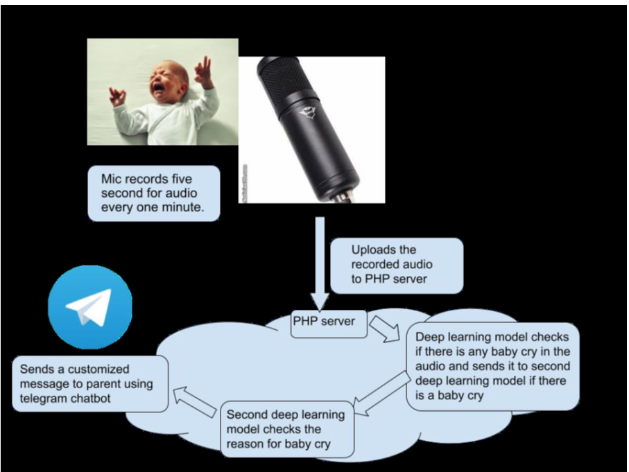

# Infant Cry Classification System

This project aims to develop an intelligent deep learning-based system that classifies and identifies the reasons behind an infant's cry. By integrating temperature and pulse sensors with a microphone, the system analyzes the infant’s cry and predicts whether the cry is caused by tiredness, pain, burping, hunger, or discomfort, ensuring caregivers can respond promptly and appropriately

## Features:
- **Cry Detection**: Identifies whether the audio input contains an infant's cry.
- **Cry Classification**: Determines the reason behind the cry using features such as pitch and intensity.
- **Sensor Integration**: Incorporates temperature and pulse sensors to gather additional health data.
- **Alerts**: Notifies caregivers via a Telegram bot with the reason for the cry and relevant sensor readings.

## Components:
- **DS18B20 Temperature Sensor**: Captures and transmits the infant’s body temperature.
- **Super Debug Heart Pulse Sensor**: Monitors the infant’s pulse rate.
- **Microphone**: Records 5 seconds of audio every minute to detect and classify cries.
- **Raspberry Pi**: Serves as the central processing unit to manage data collection, prediction, and alerts.

## Dataset:
The model is trained using the [Donate a Cry Corpus Dataset](https://asmp-eurasipjournals.springeropen.com/articles/10.1186/s13636-021-00197-5), which consists of 250 audio files labeled with different reasons such as:
- Tiredness
- Pain
- Burping
- Hungry
- Discomfort

## How It Works:
1. The microphone records 5 seconds of audio at one-minute intervals.
2. A deep learning model detects if the audio contains infant crying.
3. If crying is detected, a second deep learning model analyzes the cry to determine its cause.
4. Additional data from the temperature and pulse sensors are sent alongside the cry classification.
5. The system sends an alert to the parent via a Telegram bot with the detected reason for the cry.

## System Flow:


## Model:
Two convolutional neural networks (CNN) are used:
- **Cry Detection Model**: Identifies whether the input audio contains a baby cry.
- **Cry Classification Model**: Classifies the reason for the cry based on the characteristics of the audio.

## Results:
- Cry Detection Accuracy: 95%
- Cry Classification Accuracy: 90%


### Software Setup:
1. Clone this repository.
   ```bash
   git clone https://github.com/username/infant-cry-classification.git
   cd infant-cry-classification
